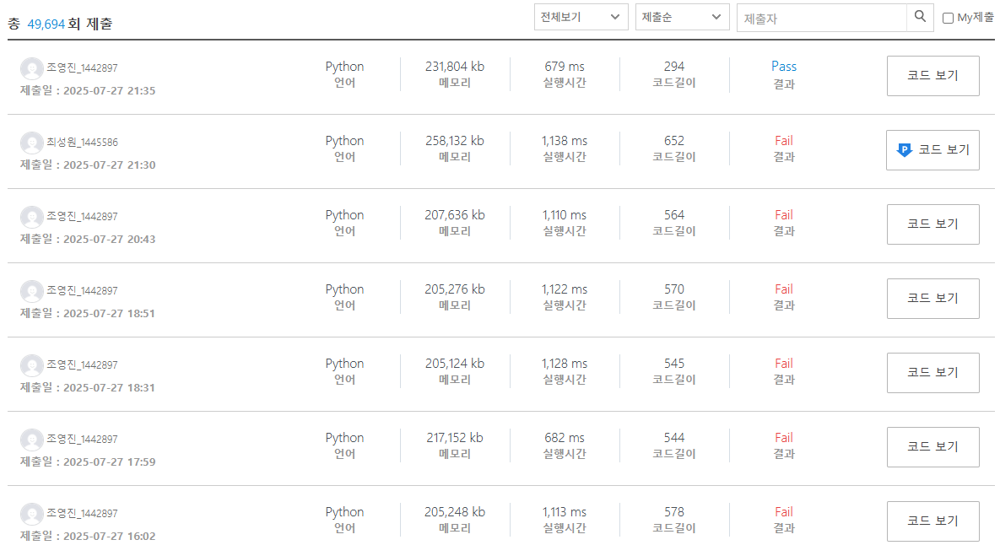

## 삽질끝에 문제를 결국 풀어냈다!

## 회고
우선 풀었던 문제는 swea의 1859번 문제이다.
해당 문제를 풀기 위해선, reversed함수를 통해 역방향으로 배열을 탐색하여
max값을 갱신하고, result에 max - 배열[j] 만큼을 채워넣어야 되었었다.

해당 문제의 대한 정답을 맞추기 전, 나는 새로운 배열을 생성하고,
기존 배열을 sort()시켜, 탐색을 진행하고, 최대값에 도달할때마다 pop을 수행하는 형식으로 과제를 풀었었다. **시간초과 때문에 여러번 틀렸었다.**

앞으로 경각심을 가져야겠다.