초기에 3tier로 VM 3대를 생성하여 구축해야되었으나, 단일 VM에 nextcloud를 구축해보았다.

## VM 생성

1. 가상머신 생성을 진행한다。
<p>

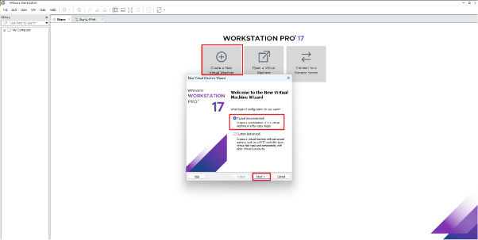

</p>

2. 데비안 리눅스 기반 ISO 이미지를 선택한다.
<p>

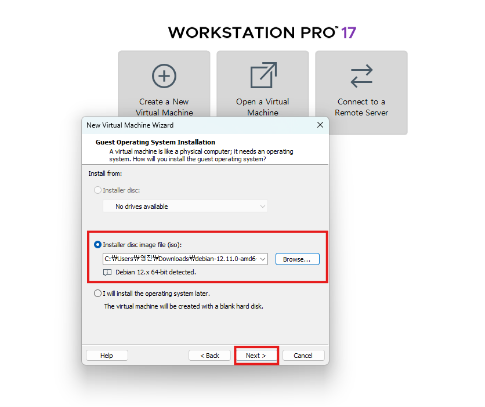

</p>
3. nextcloud 서버로 이름을 정의한다.
<p>

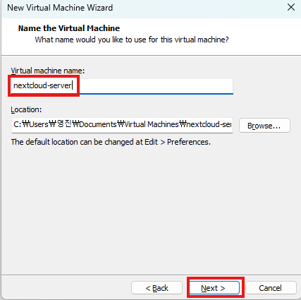

</p>

4. 200기가를 할당해준다.
<p>


</p>

5. 브리지모드 선택 후 VM에 접속한다.


## VM 초기 세팅
1. 설치할때 Graphical install을 선택한다.
<p>


</p>

2. 언어는 영어를 선택한다.
<p>

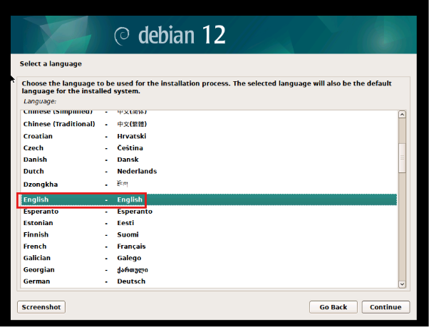

</p>
3. location을 설정해준다.
<p>

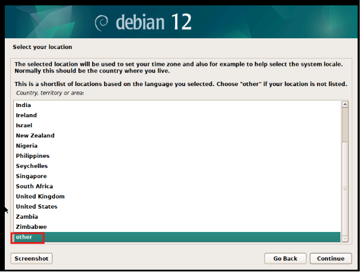

</p>
<p>


</p>
<p>


</p>

4. 언어를 선택해준다.
<p>

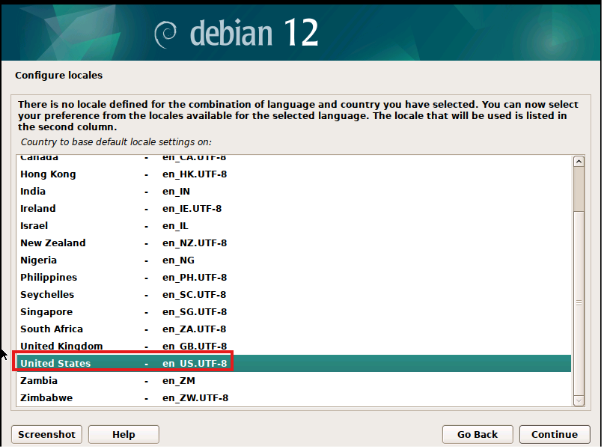

</p>
<p>


</p>

5. 네트워크 설정을 진행한다.

- hostname은 기본값으로 선택하였다.
<p>

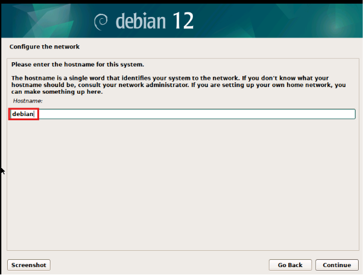

</p>

- 도메인네임도 기본값으로 선택한다.
<p>


</p>

- 루트 패스워드를 지정한다.
<p>

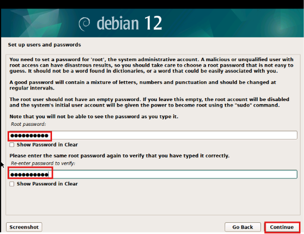

</p>

- 유저 풀네임은 기본값으로 설정하였다.
<p>

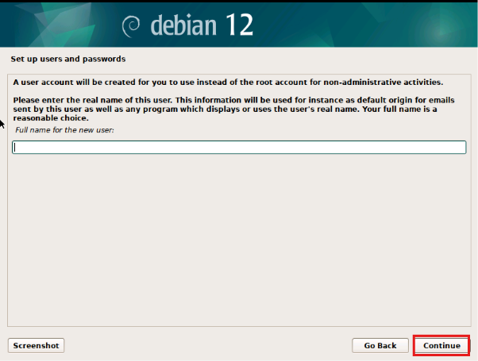

</p>

- 유저 이름은 “yeongjin”으로 설정하고, 비밀번호도 설정해주었다.
<p>

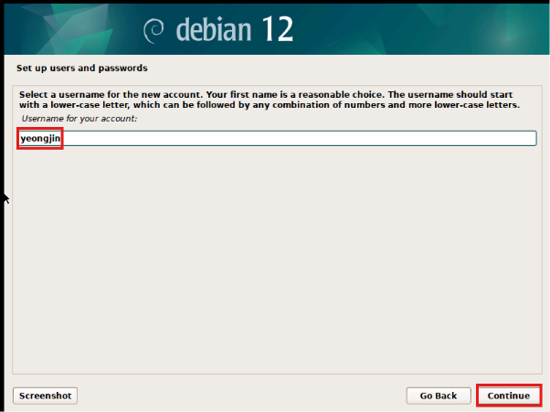

</p>
<p>

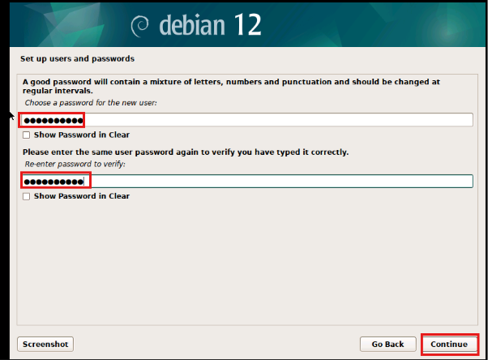

</p>

- 나중에 디스크 확장 가능성이 있기에, LVM으로 선택해주었다.
<p>

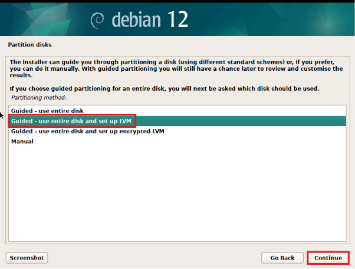

</p>
<p>

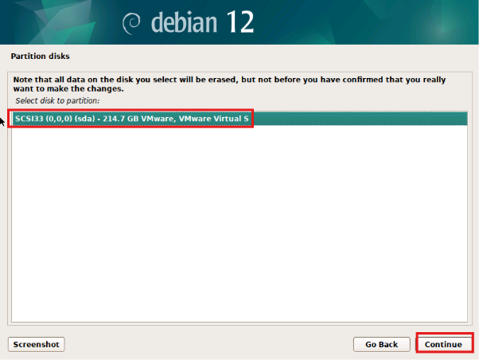

</p>

- 특정경로에 마운트를 진행한다.
<p>

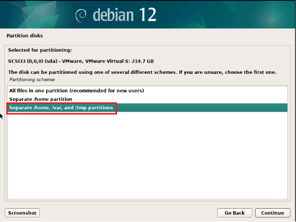

</p>
<p>

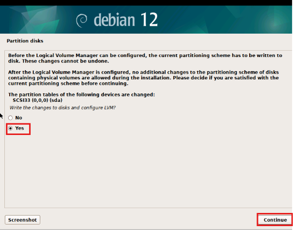

</p>
<p>


</p>
<p>

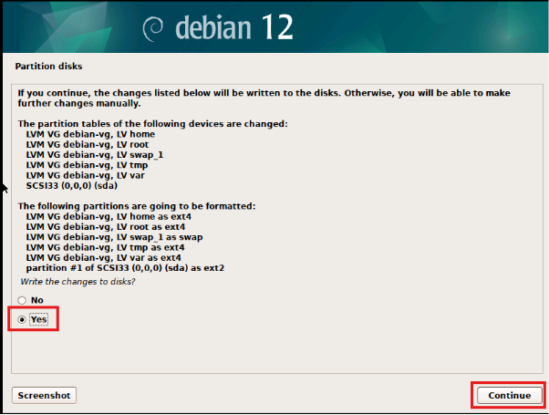

</p>

- 추가로 넣을 설치미디어는 없다.
<p>

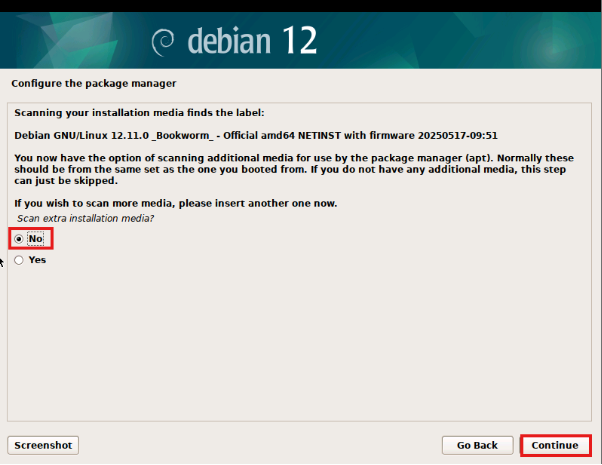

</p>

- 패키지 매니저 설정을 진행한다.
<p>


</p>
<p>


</p>
<p>

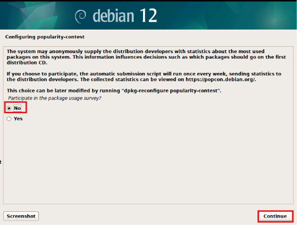

</p>

- 원격 접속과 nextcloud 사용하기 위해 web server와 ssh server를 활성화해준다.
<p>

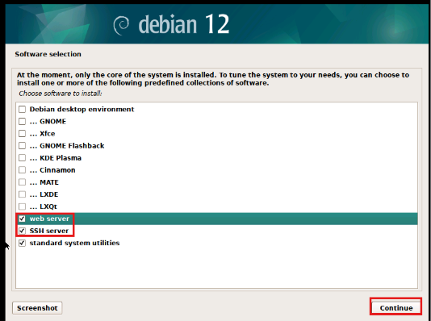

</p>

- 부르로더를 설치해준다.
<p>

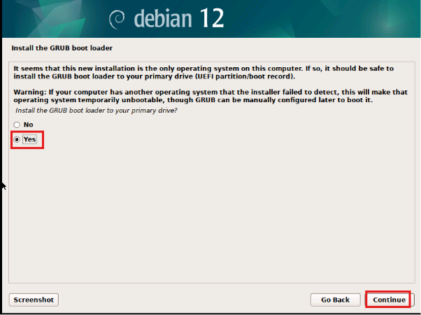

</p>
<p>


</p>
<p>

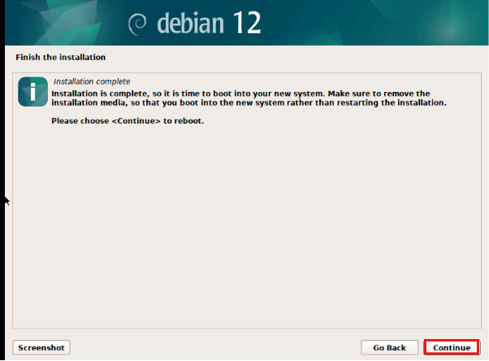

</p>

## VM 접속
1. 로그인 후 외부 아웃바운드 통신을 확인한다.
<p>

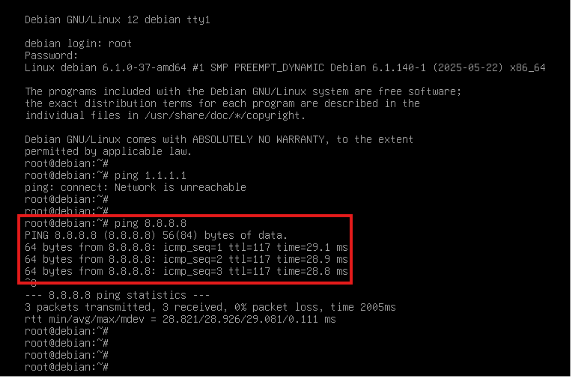

</p>

2. 패키지 업데이트 수행 후, sudo, vim등을 설치해준다.
<p>


</p>

3. /etc/ssh/sshd_config에 들어가서 포트를 변경하고, password 인증을 활성화해준다.
```sh
vim /etc/ssh/sshd_config
```
<p>

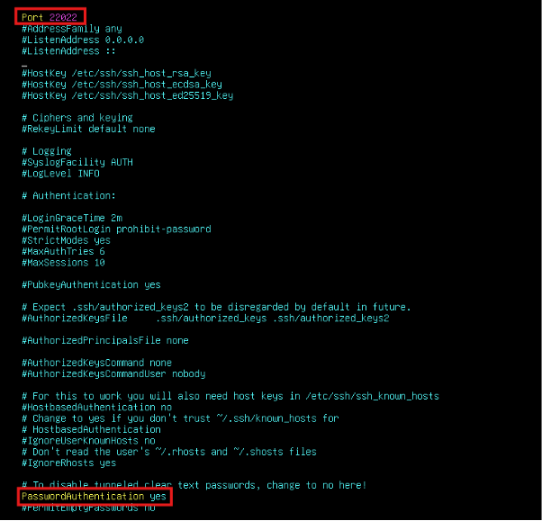

</p>

4. 설정 파일 reload 후 적용내역 확인해본다.
<p>


</p>

5. IP 주소 정보를 확인한다.
<p>


</p>

## termius ssh 접속
1. IP 정보를 바탕으로 termius에서 ssh 접속을 진행한다.
<p>


</p>
<p>


</p>

2. sudo 권한 활성화 진행

**주의:** sudoers에서 Nopasswd 옵션은 보안상 사용하지 않도록 한다. 
<p>


</p>

3. 파티션 확인
<p>


</p>

4. 심볼릭링크 설정
```sh
mkdir -p /home/nextcloud
mkdir -p /home/nextcloud-data
ln -s /home/nextcloud /var/www/nextcloud
ln -s /home/nextcloud-data /var/www/nextcloud-data
chown -R www-data:www-data /home/nextcloud /home/nextcloud-data
chmod -R 755 /home/nextcloud /home/nextcloud-data
```