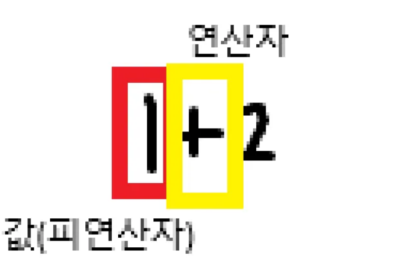

# 파이썬 철학 (Guido van Rossum이 취미로 만들었다)

- 쉽고 간결한 문법
- 강력한 커뮤니티 지원
- 웹 개발, 데이터 분석, AI, 자동화 스크립트 등 다양한 분야에서 사용
- 알고리즘 구현에도 유리
    - 간결하고 직관적인 문법
        1. 복잡한 논리 구조도 구현이 쉬움
        2. 자료형 선언이나 메모리 관리 없이 핵심 알고리즘에 집중 가능
    - 강력한 표준 라이브러리
    - 빠른 프로토타이핑

---

## 파이썬 프로그램이 실행되는 과정

인터프리터가 사용자의 명령어를 운영체제가 이해하는 언어로 변환

- 사용하기 쉽고, 운영체제 간 이식성이 뛰어나 확장성 높음

```
파이썬 프로그램 ↔ 인터프리터 ↔ 운영체제
```

- `print()` 함수: 작성한 문자를 그대로 화면에 출력
- 파이썬 파일 실행: `python3 basic.py`

---

## 표현식 (Expression)

값으로 평가될 수 있는 코드 조각

---

## 값 (Value)

표현식이 평가된 결과

---

## 평가 (Evaluate)

표현식을 실행하여 값을 얻는 과정

---


## 타입 (Type)

변수나 값이 가질 수 있는 데이터의 종류

타입 구성 요소:

- 값
- 피연산자

### 타입의 중요성

- 의미 있는 연산과 결과 보장
- 오류 예방과 디버깅 용이
- 개발 생산성과 가독성 향상

---

## 연산자 종류

| 기호 | 연산자 설명 |
| --- | --- |
| `-` | 음수 부호 |
| `+` | 덧셈 |
| `-` | 뺄셈 |
| `*` | 곱셈 |
| `/` | 나눗셈 |
| `//` | 정수 나눗셈 (몫) |
| `%` | 나머지 |
| `**` | 지수 (거듭제곱) |

---

## 연산자 우선순위

식 안에서 연산을 어떤 순서로 수행할지 결정하는 규칙

| 우선순위 | 연산자 | 설명 |
| --- | --- | --- |
| 높음 | `**` | 지수 (거듭제곱) |
| 중간 | `-` | 음수 부호 |
| 중간 | `*`, `/`, `//`, `%` | 곱셈, 나눗셈, 정수 나눗셈, 나머지 |
| 낮음 | `+`, `-` | 덧셈, 뺄셈 |

### 예시

```python
python
-2 ** 4     # -16  => -(2 ** 4)
(-2) ** 4   #  16
```

---

## 변수 (Variable)

값을 저장하기 위한 이름

- 특정 값을 저장해두고 필요할 때 꺼내서 사용

### 할당문

```python
degrees = 36.5
```

### 재할당

```python
degrees = 'abc'
```

### 할당문 구조

```python
variable = expression
```

할당 흐름:

1. `=` 오른쪽 표현식을 평가해서 값 생성
2. 해당 값의 메모리 주소를 변수에 저장
    - 새 변수일 경우 생성
    - 기존 변수일 경우 참조 주소 변경

---

## 변수, 값, 메모리

- 메모리의 모든 위치는 고유한 주소를 가짐
- 변수는 특정 메모리 주소를 참조하기 위한 이름

예시:

```python
degree = 36.5
# 36.5는 float 타입으로, 컴퓨터 어딘가의 주소에 저장됨
# 'degree'는 해당 메모리 주소를 참조함
```