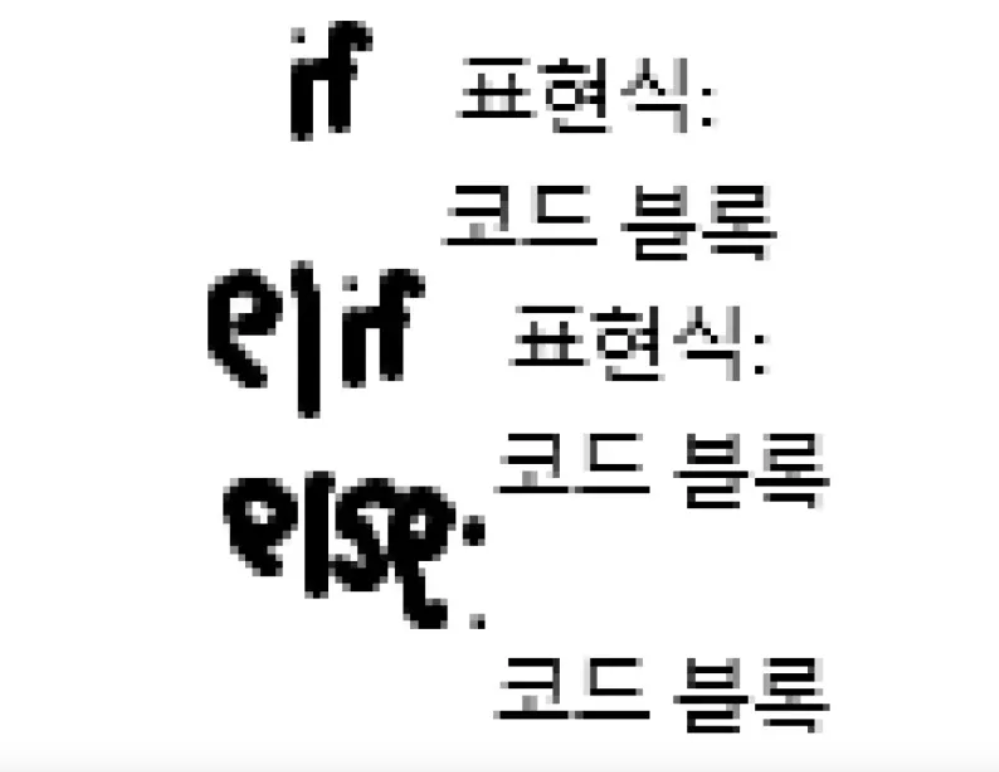

# 제어문

코드의 실행 흐름을 제어하는 데 사용되는 구문으로, 조건에 따라 코드 블록을 실행하거나 반복적으로 코드를 실행할 수 있다.


## 제어문 종류

- 조건문 (`if`, `elif`, `else`)
- 반복문 (`for`, `while`)
- 반복문 제어 (`break`, `continue`, `pass`)

---

## 조건문 (if statement)

주어진 조건식을 평가하여 **참인 경우**에만 코드 블록을 실행하거나 건너뛴다.

### if / elif / else
```python
if 조건:
    실행할 코드
elif 다른조건:
    실행할 코드
else:
    위의 조건이 모두 거짓일 때 실행할 코드
```

- `if`: 조건이 참인지 확인한다
- `elif`: 앞의 조건이 거짓일 경우 다른 조건을 확인한다
- `else`: 모든 조건이 거짓일 경우 실행된다



### 복수 조건문

- 여러 조건식을 **순차적으로 검사**하며, 하나라도 참이면 해당 블록만 실행하고 종료한다

### 중첩 조건문

- 조건문 내부에 또 다른 조건문이 들어있는 형태로, 복잡한 조건 분기를 처리할 수 있다

---

## 반복문

특정 작업을 반복적으로 수행할 때 사용한다

### for statement

- 반복 가능한 객체(iterable)를 순회하면서 각 요소에 대해 작업을 수행한다
```python
for item in items:
    print(item, end=" ")
```

### range 순회
```python
for i in range(5):
    print(i)
```

### 딕셔너리 순회
```python
my_dict = {'x': 10, 'y': 20, 'z': 30}
for key in my_dict:
    print(key)
    print(my_dict[key])
```

### 인덱스로 리스트 순회
```python
numbers = [4, 6, 10, -8, 5]
for i in range(len(numbers)):
    numbers[i] = numbers[i] * 2
print(numbers)
```

### 중첩된 반복문
```python
elements = [['A', 'B'], ['c', 'd']]
for elem in elements:
    print(elem)
```

```python
outers = ['A', 'B']
inners = ['c', 'd']
for outer in outers:
    for inner in inners:
        print(outer, inner)
```

> 위 코드의 출력 횟수는 len(outers) * len(inners)이다

---

## while statement

조건이 참인 동안 코드를 계속 반복 실행한다
```python
while 조건식:
    실행할 코드
```

- 종료 조건이 반드시 필요하며, 조건이 거짓이 되면 반복이 종료된다

### 예시 1
```python
a = 0
while a < 3:
    print(a)
    a += 1
print('끝')
```

### 예시 2
```python
user_input = ""
while user_input != "exit":
    user_input = input("입력(exit 입력시 종료): ")
```

---

## 적절한 반복문 선택 기준

| 반복문 종류 | 사용 상황 |
| --- | --- |
| `for` | 반복 횟수가 명확할 때 |
| `while` | 반복 조건이 불명확할 때 |

---

## 기타 제어 기능

- `break`: 반복문 즉시 종료
- `continue`: 이번 반복만 건너뛰고 다음 반복 실행
- `pass`: 아무것도 하지 않고 넘어감

---

## 함수 호출

함수를 실행하기 위해 함수의 이름을 사용하여 해당 함수의 코드 블록을 실행한다

```python
function_name(arguments)
```

---

## 함수 정의

- `def` 키워드로 시작한다
- 괄호 안에 **매개변수(parameter)** 를 정의한다

---

## 함수 본문 (body)

- 콜론 `:` 다음에 들여쓰기된 코드 블록을 작성한다

---

## 함수 Docstring

- 함수 설명을 위한 주석
- 함수 시작 직후에 `""" 설명 """` 형태로 작성한다

---

## 함수 반환 값

- `return` 키워드로 결과를 반환한다
- `return`은 함수를 종료하고 값을 반환한다

---

## 함수 호출

- 함수 이름과 괄호 `( )`로 호출한다
- 인자(argument)를 괄호 안에 전달한다
- 인자는 정의된 매개변수에 대입된다

---

## 매개변수 vs 인자

- **매개변수**: 함수를 정의할 때 받는 변수
- **인자**: 함수를 호출할 때 전달하는 값

---

## 위치 인자

- 인자의 **순서**에 따라 값이 전달된다

---

## 기본 인자 값

- 매개변수에 **기본값(default)** 을 할당할 수 있다
```python
def greet(name="User"):
    print(f"Hello, {name}")
```

---

## 키워드 인자

- 인자 이름을 명시하여 전달하며, 순서와 무관하다
```python
greet(name="Alice")
```

---

## 임의의 인자 목록 (*args)

- 개수가 정해지지 않은 위치 인자를 처리한다
```python
def add(*numbers):
    return sum(numbers)
```

---

## 임의의 키워드 인자 목록 (**kwargs)

- 개수가 정해지지 않은 키워드 인자를 처리한다
```python
def print_info(**info):
    for key, value in info.items():
        print(key, value)
```

---

## Python의 범위(Scope)

- 함수는 **local scope**를 생성하고, 그 외는 **global scope**이다

### 변수 종류

- **Global Variable**: 전역 범위에 정의
- **Local Variable**: 함수 내부에서 정의

---

## 변수의 수명주기

| Scope 유형 | 생성 시점 | 소멸 시점 |
| --- | --- | --- |
| Built-in scope | 파이썬 실행 시 | 프로그램 종료 시 |
| Global scope | 모듈 실행 시 | 인터프리터 종료 시 |
| Local scope | 함수 호출 시 | 함수 종료 시 |

---

## 이름 검색 규칙 (LEGB Rule)

파이썬에서 이름을 찾는 순서:

1. **Local scope**: 현재 함수 내부
2. **Enclosed scope**: 중첩 함수의 바깥 함수
3. **Global scope**: 모듈 최상단
4. **Built-in scope**: 내장 영역
