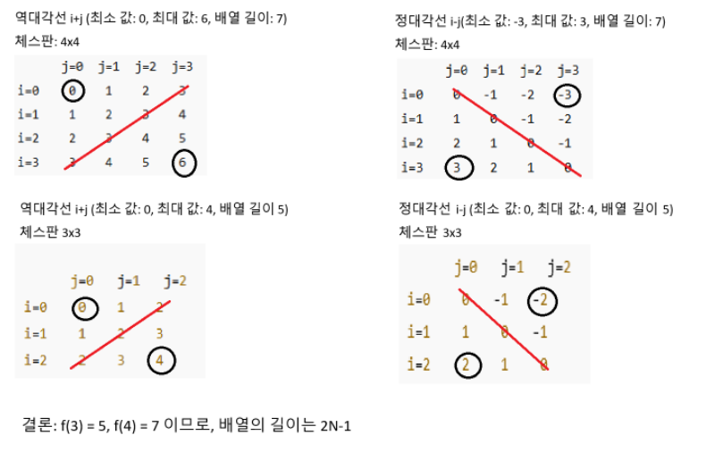

# N-Queen 백트래킹 풀이 과정 및 회고

## 문제 설명
N×N 체스판에 N개의 퀸을 서로 공격하지 않도록 배치하는 경우의 수를 구하는 문제다.  
퀸은 같은 행, 같은 열, 같은 대각선에 존재하면 서로 공격한다.  
이 코드는 해의 **개수만** 계산한다.

---

## 규칙 요약
- 좌표는 `(i, j)`로 표기하고 `i`는 행, `j`는 열이다.
- 정대각선(↘) 규칙은 `i - j`가 같다이다.
- 역대각선(↙) 규칙은 `i + j`가 같다이다.
- 방문 상태는 1차원 불린 배열 세 개로 관리한다.
  - `col[j]`: 열 사용 여부다.
  - `diag_lst[i - j]`: 정대각선 사용 여부다.
  - `r_diag_lst[i + j]`: 역대각선 사용 여부다.
- 대각선 배열 길이는 모두 `2*N - 1`로 둔다.



---

## 가지치기(백트래킹) 흐름
1. 현재 행 `i`에서 `j=0..N-1` 후보를 순회한다.
2. `col[j]`, `diag_lst[i-j]`, `r_diag_lst[i+j]` 중 하나라도 사용 중이면 즉시 `continue`로 건너뛴다.
3. 모두 미사용이면 세 배열을 `True`로 표시하고 다음 행 `i+1`로 내려간다.
4. 하위 탐색이 끝나면 세 배열을 `False`로 복원하고 다음 열 후보를 계속 시도한다.
5. `i == N`에 도달하면 유효 배치 하나를 찾은 것이므로 카운트를 1 증가시킨다.

---

## 단계별 예시

### N=1
- 보드가 1×1이므로 (0,0)에 퀸을 놓으면 끝이다.
- 충돌이 없으므로 카운트는 1이다.

### N=2
- (0,0)에 두면 (1,0)은 같은 열, (1,1)은 정대각선이라 둘 수 없다.
- (0,1)에 두면 (1,1)은 같은 열, (1,0)은 역대각선이라 둘 수 없다.
- 어떤 시작점에서도 두 번째 퀸을 놓을 수 없으므로 카운트는 0이다.

### N=3
- 첫 행의 어느 열에 두어도 이후 두 행을 모두 충족시키는 배치가 만들어지지 않는다.
- 모든 분기를 시도해도 충돌이 발생하므로 카운트는 0이다.

### N=4의 한 해 경로 예시
- 알려진 해는 두 가지이며, 그중 하나인 `path = [1, 3, 0, 2]`가 어떻게 성립하는지 간단히 적는다.
  - i=0에서 j=1을 시도한다.
    - 열 1, 정대각선 `i-j= -1`, 역대각선 `i+j=1`을 사용 중으로 표시한다.
  - i=1에서 j=3을 시도한다.
    - 열 3, 정대각선 `i-j= -2`, 역대각선 `i+j=4`를 사용 중으로 표시한다.
  - i=2에서 j=0을 시도한다.
    - 열 0, 정대각선 `i-j= 2`, 역대각선 `i+j=2`를 사용 중으로 표시한다.
  - i=3에서 j=2를 시도한다.
    - 열 2, 정대각선 `i-j= 1`, 역대각선 `i+j=5`를 사용 중으로 표시한다.
  - 네 행 모두 배치가 끝났으므로 카운트를 1 증가시킨다.
- 다른 해는 `path = [2, 0, 3, 1]`이다.

---

## 디버깅 관찰 포인트
- 각 시도에서 세 배열의 해당 위치가 이미 `True`이면 그 분기는 더 내려가도 불가능하므로 즉시 건너뛴다.
- `dfs`가 반환될 때 반드시 세 배열을 `False`로 복원해야 다음 후보를 올바르게 평가한다.
- 작은 N으로 검증하면 다음과 같이 나와야 한다.
  - N=1 → 1이다.
  - N=2 → 0이다.
  - N=3 → 0이다.
  - N=4 → 2이다.
  - N=5 → 10이다.

---

## 전체 코드

```python
import sys
input = sys.stdin.readline
N = int(input())
cnt = 0
col = [False] * N # 열 길이
diag_lst = [False] * (2*N-1) # 대각선 길이
r_diag_lst = [False] * (2*N-1) # 역대각선 길이

def dfs(i):
    global cnt
    if i == N:
        cnt += 1
        return
    for j in range(N):
        diag = i - j                                                    # 정대각선 규칙
        r_diag = i + j                                                  # 역대각선 규칙 
        if col[j] or diag_lst[diag] or r_diag_lst[r_diag]:              # 셋중에 하나가 참인 경우
            continue                                                    # 건너 뛰기
        col[j] = diag_lst[diag] = r_diag_lst[r_diag] = True             # 방문 체크
        dfs(i+1)
        col[j] = diag_lst[diag] = r_diag_lst[r_diag] = False            # 가지치기

dfs(0)
print(cnt)
```

## 회고
- 처음에는 문제 접근법 자체를 몰라서 관련 영상을 다섯 번 이상 반복해서 보며 개념을 익혔다.  
- 그러다가 정대각선은 `i-j`, 역대각선은 `i+j` 규칙이라는 핵심을 이해했다.  
- 처음에는 2차원 배열을 `False`로 채우고 딥카피로 상태를 넘기는 방식을 떠올렸으나, 메모리와 성능에 비효율적이라는 점을 알게 되었다.  
- 열과 대각선만 별도의 1차원 배열로 관리하면 충돌 판정이 O(1)로 가능하고, 백트래킹 복구도 간단하다는 사실을 배웠다.  
- 가지치기의 목적은 실패가 확정된 분기를 가능한 한 빨리 탈락시키는 데 있으며, 이 코드에서는 `continue`가 그 역할을 정확히 수행한다.  

