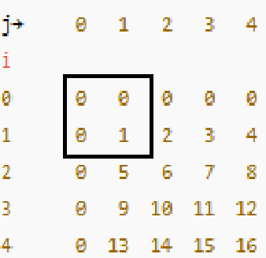
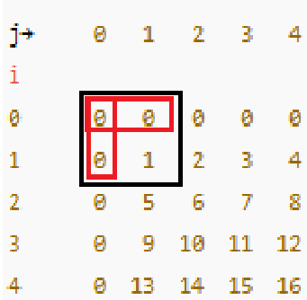
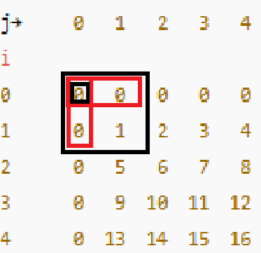

# 구간 합 구하기 5 (백준 11660)

## 1. 문제 링크
[백준 11660 - 구간 합 구하기 5](https://www.acmicpc.net/problem/11660)

## 2. 문제 설명
N×N 크기의 2차원 배열이 주어지고, M개의 질의가 주어진다. 각 질의는 (x1, y1, x2, y2) 형태이며, 해당 좌표로 이루어진 직사각형 안에 포함된 모든 수의 합을 구하는 문제다.  
브루트포스 방식으로 구현하면 시간 복잡도가 O(N²M)이 되어, N과 M이 최대 1,000일 때 10⁹ 연산이 발생하여 시간 초과가 난다.  
따라서 2차원 누적합(Prefix Sum)을 사용해야 한다.

## 3. 접근 과정

### 3.1 첫 번째 접근
```python
import sys
input = sys.stdin.readline
a,b = map(int, input().split())
lst = [list(map(int, input().split())) for _ in range(a)]
result_lst = []
for i in range(b):
    q,w,e,r = map(int, input().split())
    result = 0
    arr = [[False for _ in range(a)] for _ in range(a)]
    for j in range(q-1, e):
        for k in range(w-1, r):
            if arr[j][k] == False:
                arr[j][k] = True
                result += lst[j][k]
    result_lst.append(result)
for i in result_lst:
    print(i)
```

- 매 질의마다 새로운 방문 배열(arr)을 만들어 중복 계산을 방지하려고 했다.
- 하지만 여전히 모든 원소를 직접 순회하는 구조라 O(N²M) 시간이 걸린다.
- 시간 초과가 발생했다.

### 3.2 두 번째 접근
```python
import sys
input = sys.stdin.readline
a,b = map(int, input().split())
lst = [list(map(int, input().split())) for _ in range(a)]
result_lst = []
result = [0] * b
for i in range(b):
    q,w,e,r = map(int, input().split())
    for j in range(q-1, e):
        for k in range(w-1, r):
            result[i] += lst[j][k]
for i in result:
    print(i)
```
- 방문 배열을 없애고, 단순히 질의 범위의 합을 직접 구했다.
- 여전히 모든 질의마다 범위 안의 모든 원소를 순회하므로 시간 초과가 발생했다.

### 3.3 세 번째 접근
```python
import sys
input = sys.stdin.readline
a,b = map(int, input().split())
lst = [[0] * (a + 1)] + [[0] + list(map(int, input().split()))for _ in range(a)]
for i in range(1, a+1):
    for j in range(1, a+1):
        lst[i][j] = (
            lst[i][j]           # 현재 값
            + lst[i-1][j]       # 위쪽 값 누적
            + lst[i][j-1]       # 왼쪽 값 누적
            - lst[i-1][j-1]     # 겹치는 대각선 값 제거
        )
for _ in range(b):
    q,w,e,r = map(int, input().split())
    result = (
        lst[e][r]               # 전체 합
        - lst[q-1][r]           # 위쪽 직사각형 제거
        - lst[e][w-1]           # 왼쪽 직사각형 제거
        + lst[q-1][w-1]         # 교집합 복원
    )
    print(result)
```
- 2차원 누적합을 활용하여 O(1)에 질의 응답을 처리했다.
- 맨 위와 맨 왼쪽에 0을 패딩하여 인덱스 범위를 단순화했다.

## 4. 누적합 변환 과정

**초기 배열**
```
j→     0   1   2   3   4
i
0      0   0   0   0   0
1      0   1   2   3   4
2      0   5   6   7   8
3      0   9  10  11  12
4      0  13  14  15  16
```

4-1. 검은색 박스만큼 더한다.



4-2. 빨간색 박스만큼 제거한다.



4-3. 빨간색의 교집합에 해당되는 부분을 다시 더한다.



4-4. (1,1)에 더한 결과값을 저장하고, 1,2부터 동일한 과정을 반복한다.

## 5. 회고
처음에는 단순히 범위를 순회하며 더하는 방식으로 접근했으나, 입력 크기에서 시간 초과가 발생했다. 이후 유튜브로 2차원 누적합 개념을 공부했고, 맨 위와 맨 왼쪽에 0을 패딩하는 방식으로 구현을 단순화할 수 있었다. 또한 질의 처리 과정에서 직사각형의 합을 구할 때, 전체 → 위쪽 제거 → 왼쪽 제거 → 겹치는 부분 복원이라는 흐름을 확실히 이해하게 되었다. 이번 문제를 통해 1차원 누적합과 2차원 누적합의 구조 차이와 구현 방법을 정확히 체득할 수 있었다.