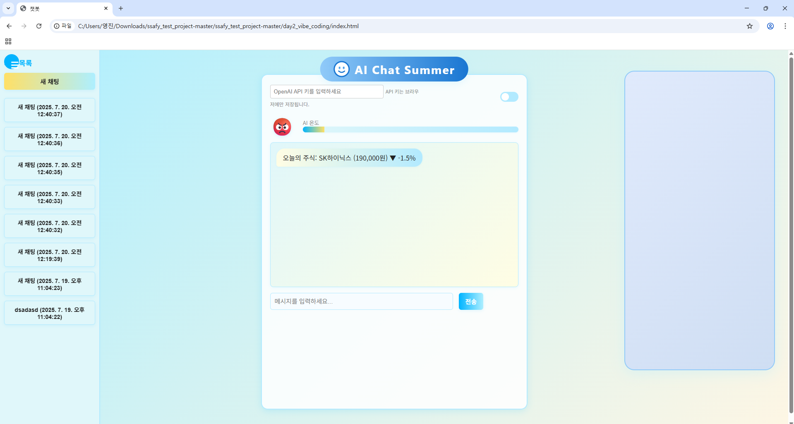
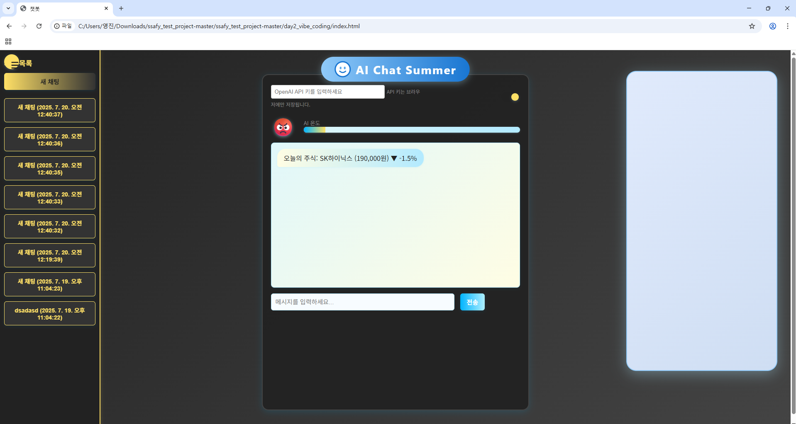

# vibe_coding

# Generative AI

Generative AI는 기존의 패턴을 기반으로 다양한 콘텐츠를 생성하는 인공지능 모델로, 오디오, 비디오, 이미지, 텍스트, 코드, 시뮬레이션 등 여러 형태의 새로운 데이터를 창출한다.

---

# Pre-trained 모델

- *거대 언어 모델(Pre-trained Models)**은 대규모 데이터셋을 이용해 미리 학습된 모델로, 후속 작업에 사용되는 **추가 학습 데이터** 및 **강화 학습**을 통해 성능을 더욱 향상시킬 수 있다.

---

# Transformer 모델

- **Transformer**는 문장 속 단어 간의 관계를 추적하여 문맥과 의미를 학습하는 모델이다. 이 모델은 인간처럼 일관되며 연관성 높은 언어를 생성할 수 있어 대화형 작업에서 강점을 보인다.
- **Attention 메커니즘**: Transformer는 문장을 효율적으로 이해하고 관리하는 데 중요한 역할을 한다.

---

# Transformer 주요 개념

1. **Self-Attention 메커니즘**: 입력 데이터 내 단어 간의 관계를 계산하여 중요한 정보에 집중한다.
2. **병렬 처리 가능**: 문장 내 단어 간 관계를 동시에 처리할 수 있어 속도가 빠르고 효율적이다.
3. **스케일링 가능**: 모델이 커질수록 성능을 확장할 수 있어 다양한 크기의 데이터셋에 대응할 수 있다.

---

# Interface

- **Interface**는 서로 다른 두 시스템 간의 정보 교환을 위한 접점이다.
- **UI**가 없더라도, 약속된 방식으로 데이터를 주고받을 수 있다.

---

# UI (User Interface)

- **UI**는 사용자가 소프트웨어나 시스템과 상호작용하는 그래픽적, 화면적 요소이다. 직관적인 UI는 사용자의 편리한 접근을 돕는다.

---

# 웹의 동작 구조

웹에서는 두 가지 주요 컴포넌트가 상호작용한다:

- **클라이언트**: 웹 브라우저를 통해 서버에 요청을 보내는 쪽이다.
- **서버**: 클라이언트의 요청을 처리하고, 결과를 응답하는 시스템이다.

---

# API (Application Programming Interface)

- **API**는 두 소프트웨어가 서로 통신할 수 있도록 해주는 메커니즘이다.
    - **약속된 방식의 인터페이스**를 통해 데이터나 기능을 공유한다.
    - 예를 들어, 웹사이트에서 다른 서비스를 호출하는 경우 API를 사용한다.

---

# Application

- **Application**은 특정 기능을 수행하는 소프트웨어로, 사용자가 특정 작업을 진행하는 데 필요한 프로그램이다.

---

# API Key

- **API Key**는 API를 호출하는 애플리케이션을 구별하기 위한 고유한 식별 문자열이다.
    - **보안 강화**: 무단 접근을 차단하고 승인된 사용자만 요청을 보낼 수 있도록 한다.
    - **데이터 관리**: API 호출 횟수, 사용량 모니터링을 통해 관리된다.