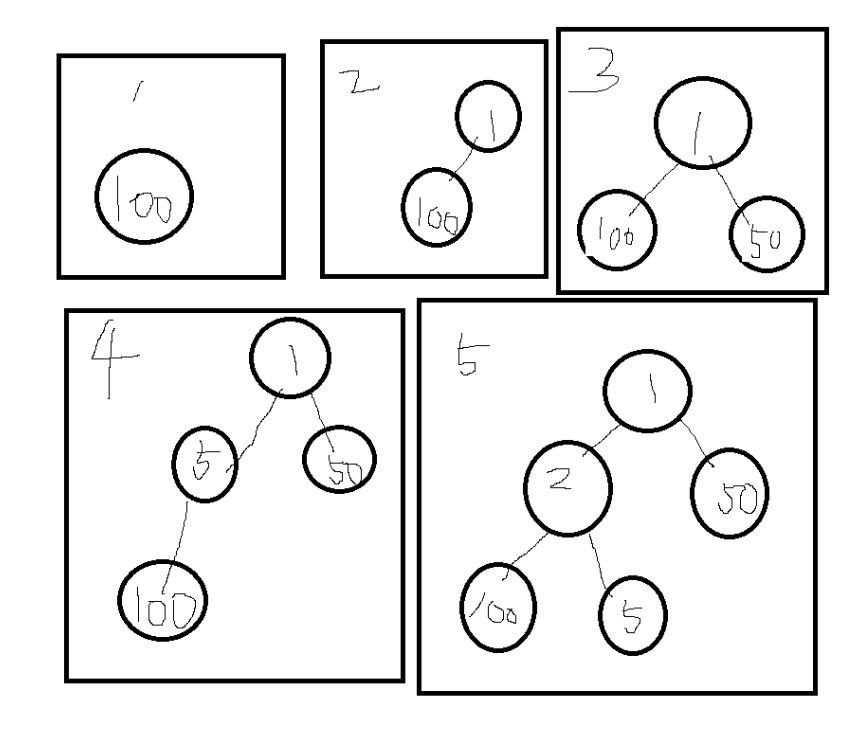

## 우선순위 큐
- 우선순위가 가장 높은 데이터를 가장 먼저 삭제하는 자료구조이다.
- 데이터를 우선순위에 따라 처리하고 싶을 때 사용한다.

### 구현 방법
- 리스트 이용 구현
- 힙(heap)을 이용하여 구현

### 데이터 개수가 N개일 때 시간 복잡도 비교

**리스트**
- 삽입 시간: O(1)
- 삭제 시간: O(N)

**힙 (Heap)**
- 삽입 시간: O(logN)
- 삭제 시간: O(logN)

> N개의 데이터를 힙에 넣었다가 모두 꺼내는 작업은 정렬과 동일 (힙 정렬)  
> 이 경우 시간 복잡도는 O(NlogN)이다.

---

## 힙의 특징
1. 힙은 완전 이진 트리 자료구조의 일종이다.
2. 힙에서는 항상 루트 노드를 제거한다.

### 최소 힙 (Min Heap)
- 루트 노드가 가장 작은 값을 가진다.
- 값이 **작은** 데이터가 우선적으로 제거된다.


- 리스트로 표현하면 `[3, 5, 7, 9, 6]`이다.

- 코드 구현
    ```python
    import heapq

    heap = []
    heapq.heappush(heap, 3)
    heapq.heappush(heap, 5)
    heapq.heappush(heap, 7)
    heapq.heappush(heap, 9)
    heapq.heappush(heap, 6)

    print(heap)
    ```

**100, 1, 50, 5, 2**을 순서대로 삽입할 경우
- 코드 구현
    ```python
    import heapq

    heap = []
    heapq.heappush(heap, 100)
    heapq.heappush(heap, 1)
    heapq.heappush(heap, 50)
    heapq.heappush(heap, 5)
    heapq.heappush(heap, 2)

    print(heap)
    ```


- 리스트로 표현하면 `[1, 2, 50, 100, 5]`이다.


### 최대 힙 (Max Heap)
- 루트 노드가 가장 큰 값을 가진다.
- 값이 **큰** 데이터가 우선적으로 제거된다.
