## php를 설치한다.
```sh
#!/bin/bash
sudo apt install -y php php-curl php-cli php-mysql php-gd php-common php-xml php-json php-intl php-pear php-imagick php-dev php-common php-mbstring php-zip php-soap php-bz2 php-bcmath php-gmp php-apcu libmagickcore-dev php-redis php-memcached
```

## /etc/php/8.2/apache2/php.ini 수정
vim 에디터를 통해 접속한다.
```sh
:set nu #라인 표시 
```

979번 라인을 수정한다.
<p>

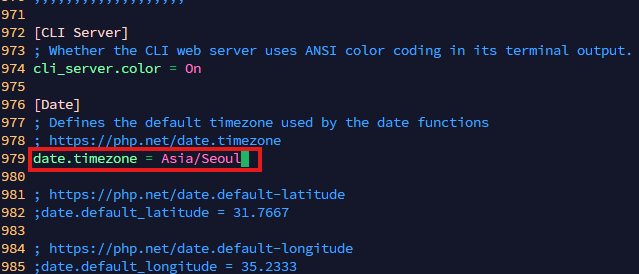

</p>

435번 라인에 memory_limit 파라미터를 조정한다.
<p>

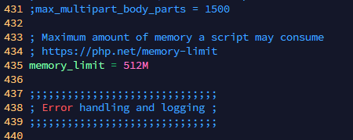

</p>


855라인에 upload_max_filesize 파라미터를 조정한다.

<p>

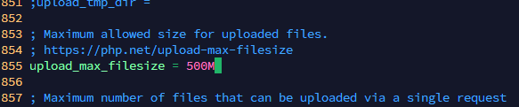

</p>

703라인에 post_max_size 파라미터를 조정한다.

<p>

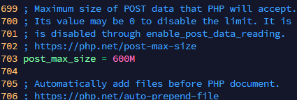

</p>

409라인에 max_execution_time 파라미터를 조정한다.
<p>

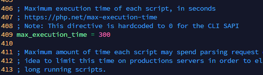

</p>


226라인에 파라미터값을 Off로 설정한다.
<p>

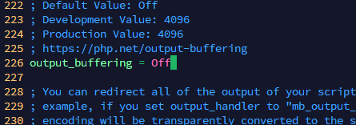

</p>


966라인 주석을 제거한다.
<p>

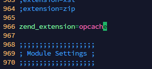

</p>

1786, 1792, 1795, 1799번라인 주석을 제거한다.
<p>

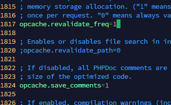

</p>

1817, 1824 주석 제거, 1817 주석제거 후 파라미터값 1로 변경한다.
<p>

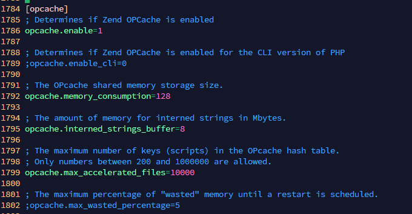

</p>

apache를 다시 시작한다.
```sh
systemctl restart apache2
```


## mariadb 서버를 설치한다.
```sh
sudo apt install -y mariadb-server
sudo systemctl is-enabled mariadb 
sudo systemctl status mariadb
```
<p>

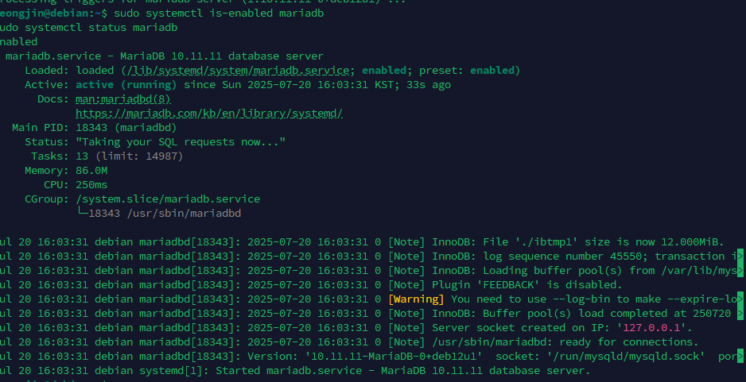

</p>


데이터베이스를 접속하여 사용자와 비밀번호를 생성한다.
```sql
CREATE DATABASE nextcloud_db;
CREATE USER nextcloud@localhost IDENTIFIED BY 'dudwls';
GRANT ALL PRIVILEGES ON nextcloud_db.* TO nextclouduser@localhost;
FLUSH PRIVILEGES;
```

## nextcloud 설치를 진행한다.
```sh
sudo apt install -y unzip
cd /var/www/
sudo wget https://download.nextcloud.com/server/releases/latest.zip
sudo unzip latest.zip
sudo chown -R www-data:www-data nextcloud
```

## 아파치에 가상 호스트를 구성한다.
```sh
vim /etc/apache2/sites-available/nextcloud.conf
```

/etc/apache2/sites-available/nextcloud.conf
```sh
<VirtualHost *:80>
    ServerName nextcloud.yeongjin.local
    DocumentRoot /var/www/nextcloud/

    # log files
    ErrorLog /var/log/apache2/files.howtoforge.local-error.log
    CustomLog /var/log/apache2/files.howtoforge.local-access.log combined

    <Directory /var/www/nextcloud/>
        Options +FollowSymlinks
        AllowOverride All

        <IfModule mod_dav.c>
            Dav off
        </IfModule>

        SetEnv HOME /var/www/nextcloud
        SetEnv HTTP_HOME /var/www/nextcloud
    </Directory>
</VirtualHost>
```

nextcloud.conf 구성 활성화 후 apache를 재시작한다.
```sh
sudo a2ensite nextcloud.conf 
sudo apachectl configtest
sudo systemctl restart apache2
```

이후 nextcloud.yeongjin.local에 접속하면 사진과 같은 페이지가 표시된다.
<p>

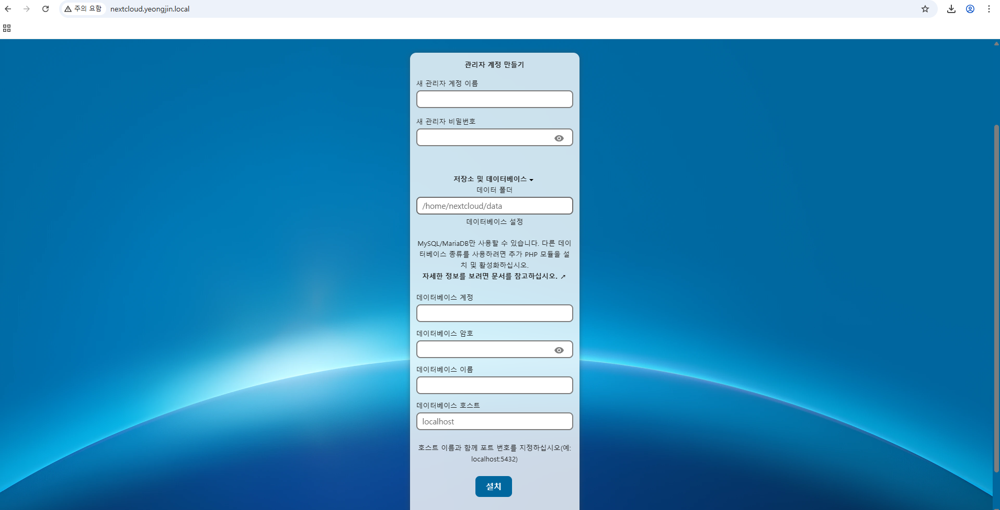

</p>
<p>

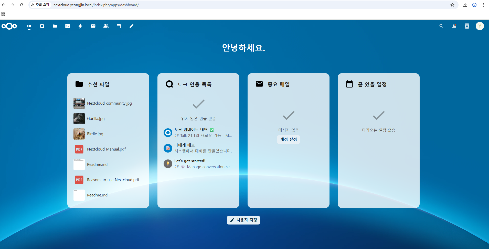

</p>


## 성능 튜닝을 진행한다.
```sh
vim /var/www/nextcloud/config/config.php
```

22번라인에 추가한다.
<p>

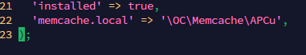

</p>

crontab을 설정한다.
```sh
sudo crontab -u www-data -e
```

에디터안에 다음 내용을 붙어 넣는다.
```sh
*/5  *  *  *  * php -f /var/www/nextcloud/cron.php
```
