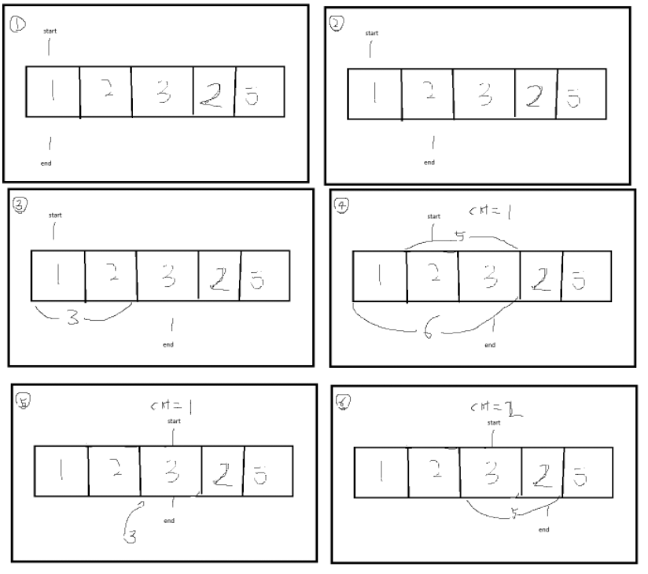

## 투포인터 알고리즘

나는 오늘 백준 알고리즘 골드바흐 파티션 17103문제를 풀다가 시간초과가 발생하였다.

**문제의 코드**
```python
max = 100000
is_prime = [True] *(max+1)
is_prime[0] = is_prime[1] = False

for i in range(2, int(max**0.5)+1):
    if is_prime[i]:
        for j in range(i*i, max+1, i):
            is_prime[j] = False
n = int(input())
for h in range(n):
    a = int(input())
    cnt = 0
    for k in range(2, a+1):
        if is_prime[k] == True and k+k == a:
            cnt += 1
        else:
            for l in range(k+1, a+1):
                if is_prime[k] == True and is_prime[l] == True and k+l == a:
                    cnt += 1
    print(cnt)
```

문제의 코드 부분
```python
    for k in range(2, a+1):
        if is_prime[k] == True and k+k == a:
            cnt += 1
        else:
            for l in range(k+1, a+1):
                if is_prime[k] == True and is_prime[l] == True and k+l == a:
                    cnt += 1
```

이 문제를 개선하기 위해 투포인터 알고리즘을 사용해야된다는 것을 깨달았다.

아래는 공부한 내용이다.

부분 수열 찾는 방법
1. 시작점(start)과 끝점(end)이 첫번째 원소의 인덱스를 가리킴
2. 현재 부분 합이 M과 같다면, 카운트
3. 현재 부분 합이 M보다 작다면, end를 1 증가
4. 현재 부분 합이 M보다 크거나, 같다면 start를 1증가
5. 모든 경우의 수 확인이 다 될때까지 리스트 길이만큼 반복

- 그림판을 활용하여 공부한 내용은 아래와 같다.



개선된 코드 -> 시간초과로 인한 추가 개선 필요
```python
max = 1000000
is_prime = [True] *(max+1)
is_prime[0] = is_prime[1] = False

for i in range(2, int(max**0.5)+1):
    if is_prime[i]:
        for j in range(i*i, max+1, i):
            is_prime[j] = False
n = int(input())
for h in range(n):
    a = int(input())
    cnt = 0
    start = 2
    end = a
    while start <= end:
        if is_prime[start] and is_prime[end] and start + end == a:
            cnt += 1
            start += 1
            end -= 1
        elif start + end < a:
            start += 1
        else:
            end -= 1
    print(cnt)
```

## 회고
시간이 너무 늦은 관계로 ,투포인트 알고리즘을 활용하여, 문제풀이까지만 진행하였다.
start += 1, end -= 1은 거의 브루트포스와 유사하게 비효율적으로 코드를 처리하여,
개선이 필요할 것 같다.


## + 2025-07-22
나는 결국 투포인터 알고리즘이 아닌, for문을 최적화하여 문제를 해결하였다.
```python
max = 1000000
is_prime = [True] *(max+1)
is_prime[0] = is_prime[1] = False

for i in range(2, int(max**0.5)+1):
    if is_prime[i]:
        for j in range(i*i, max+1, i):
            is_prime[j] = False


n = int(input())
for h in range(n):
    a = int(input())
    cnt = 0
    for j in range(2, (a//2)+1):
        if is_prime[j] and is_prime[a - j]:
            cnt += 1
    print(cnt)
```
for문으로 인해, 시간초과가 발생하여, 절반으로 줄여보았다.

결과값 = (결과값-차감수) + 차감수 = 참이되어,

이러한 방식으로 풀이를 진행하였다.
