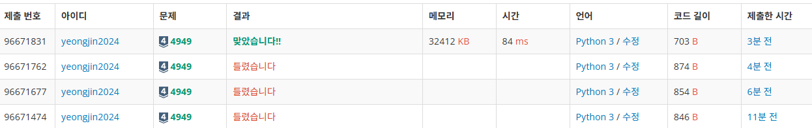

## 균형잡힌 세상
여러번의 실패끝에 결국 정답을 찾아냈다!


```python
import sys
input = sys.stdin.readline

while True:
    stack = []
    a = input()
    if a == ".\n":
        break

    for i in range(len(a)):
        if a[i] == '(':
            stack.append('(')
        elif a[i] == ')':
            if len(stack) > 0 and stack[-1] == '(':
                stack.pop()
            else:
                print("no")
                break
        elif a[i] == '[':
            stack.append('[')
        elif a[i] == ']':
            if len(stack) > 0 and stack[-1] == '[':
                stack.pop()
            else:
                print("no")
                break
    else:
        if len(stack) == 0:
            print("yes")
        else:
            print("no")
```

## 회고

기존 코드

```python
    if len(stack) == 0:
        print("yes")
```
변경 코드
```python
    else:
        if len(stack) == 0:
            print("yes")
        else:
            print("no")
```
해당라인에, else를 안쓰고, print("yes")를 할 경우, 문제에서 오답으로 처리된다는 사실을 알게되었다.